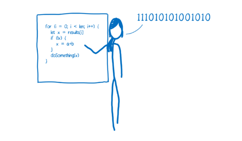

# 1주차 과제: JVM은 무엇이며 자바 코드는 어떻게 실행하는 것인가

날짜: 2022년 3월 1일

### Java, WORA

 Java는 다른 언어들과 다르게 굳이 JVM을 통해 실행되는데, 그 이유는 무엇일까. 바로 Java의 기원에 **WORA(Wrtie Once Read Always)**가 있기 때문이다. 

컴퓨터는 0,1로 이루어진 기계어만 이해할 수 있다. 하지만 기계어는 복잡한 프로그램을 만드는 목적에 그대로 사용되기엔 인간이 이해하기에 너무 복잡했다. 따라서 이 문제를 해결하기 위해 기계어와 대응되는 의미있는 단어들로 이루어진 어셈블리어를 만들었다. 하지만 어셈블리어는 기계어와 일대일로 대응되기 때문에 CPU와 운영체제에 종속적이라는 문제점이 있었다. 즉 사용하는 CPU에 따라 어셈블리어를 매번 새롭게 작성해야하는 문제점이 다시 생긴 것이다. 위와 같은 문제를 해결하기 위해 등장한 것이 고수준 언어가 C언어다.

C언어의 장점을 찾아보면 공통적으로 나오는 것이 바로 ‘높은 이식성’이다. 하지만 위 그림처럼 플랫폼의 의존성을 떼어내지 못한다. 그래서 이를 극복한 Java가 등장한다.

JVM은 운영체제에 상관없이 JVM만 설치되어 있다면 어디든 동일한 실행결과를 보장한다. C/C++ 등의 전통적인 언어는 플랫폼에 따라 int 형의 크기가 변한다. 하지만 JVM은 기본 자료형을 명확하게 정의하여 호환성을 유지하고 플랫폼 독립성을 보장한다. 또한 바이트 코드를 통해 플랫폼에 대한 의존성을 제거하여 JVM만 있다면 언제든 자바 애플리케이션이 실행할 수 있는 환경을 보장한다. 이를 통해 C언어가 갖던 플랫폼 독립성의 문제를 해결할 수 있게 된다. 

‘*모든 소프트웨어 공학의 정답은 인다이렉션이다.’* 이라는 말이 있다. Java는 C언어가 갖던 플랫폼 독립성 문제를 J**VM이라는 인다이렉션의 생성**과 기계어와 인간의 **커뮤니케이션 툴을 바이트코드로 변경**하는 것을 통해 해결했다고 생각하면 이해가 쉬울 것이다.

> *자바 컴파일러는 C/C++ 등의 컴파일러처럼 고수준 언어를 기계어, 즉 직접적인 CPU 명령으로 변환하는 것이 아니라, 개발자가 이해하는 자바 언어를 JVM이 이해하는 자바 바이트코드로 번역한다. 따라서 자바 바이트코드는 플랫폼 의존적인 코드가 없어 JVM(정확하게 말하자면 같은 프로파일의 JRE)이 설치된 장비라면 CPU나 운영체제가 다르더라도 실행 가능하다. (윈도우 PC에서 개발하여 컴파일한 클래스 파일을 리눅스 장비에서도 별다른 변경 없이 실행한다)

- JVM Internal*
> 

---

### 바이트코드란 무엇인가

앞서 바이트코드가 어떤 장점을 갖고 있는지 어떤 배경에서 탄생하게 되었는지를 확인했다. 바이트코드는 0과 1로 이루어진 이진 코드다. 하지만 이는 컴퓨터가 이해하고 실행할 수 있는 바이너리 코드와 달리 가상머신만  이해하는 코드다. 백문이 불여일견이다. 바이트코드가 어떻게 생겼는지 확인해보자. 아래는 바이트코드로 변환하기 전 Java 소스파일이다.

*.java 소스코드 파일

위 소스코드를 `javap -v -p -s [클래스 파일명] > ShowByteCodeText.txt` 명령어를 통해 역어셈블링해본 결과다. 옵션은 추가정보를 출력하는 v, 모든 클래스와 멤버를 출력하는 p, 내부 타입을 표시하는 s를 사용했다. 

역어셈블링된 결과를 담은 텍스트 파일에는 클래스 파일의 위치와 수정시간, 어떤 소스코드에서부터 컴파일되었는지에 대한 메타데이터들이 명시되어있고, JVM이 운영체제에게 전달하는 바이너리 코드들이 작성되어있다. 

우리가 잊지 말아야할 것이 있다. 컴퓨터는 단 한순간도 소스코드와 바이트코드를 이해하지 못하며, 이해한 적도 없다. 컴파일러와 JVM을 통해 java코드 → 바이트코드 → 바이너리 코드로 변환되어 JVM이 바이트코드에서 변환한 바이너리 코드를 전달할 때 컴퓨터는 이해할 수 있다는 것을 잊지 말자. 

---

### JIT 컴파일러란 무엇이며 어떻게 동작하는지

자바는 인터프리터 방식으로 명령어를 런타임에서 한줄씩 해석하고 실행한다. 인터프리터는 소스코드를 기계어로 변환하는 컴파일을 전체 단계에서 수행하지 않고 한줄씩 수행하기 때문에 바로 실행이 가능하며 빠르다. 반대로 컴파일 방식은 런타임 실행 전에 소스코드를 한꺼번에 기계어로 변환한 뒤 실행하기 때문에 인터프리터 언어보다 속도가 빠르다. 

인터프리터

컴파일러

바이트코드는 인터프리트 방식으로 실행된다. 하지만 인터프리터 방식은 반복문에서 매번 같은 코드를 다시 번역하는 문제를 갖고 있다. 반면 컴파일러는 코드를 좀더 빠르게 실행시키기 위해 코드를 전체적으로 살펴보고 편집한다. 이런 편집 과정을 최적화라고 한다. 컴파일 방식은 이런 점 때문에 초기 구동 속도가 느리지만, 인터프리터가 갖는 반복에 대한 문제가 발생하지 않는다. 

반면 자바는 WORA 같은 기본적인 특성때문에 속도가 느린데에 더해 바이트코드로 변환하는 과정까지 포함되기 때문에 예전부터 ‘자바는 느리다'라는 이슈들이 많았었다. 따라서 자바는 이런 문제점을 해결하기 위해 Just-In-Time 컴파일러를 도입하여 현재는 인터프리터 방식과 컴파일 방식을 동시에 사용한다. 앞서 말했던 바이트코드에 대한 단점은 사실 자바 언어 특성상 WORA를 지원하기 때문에 필수불가결한 단점이다. 따라서 인터프리터 자체가 갖고 있는 불필요한 반복에 대한 이슈를 해결하기 위해 JIT 컴파일러가 등장했다. 

JIT 컴파일러는 모니터를 도입해 코드가 몇번 실행되는지를 체크한다. 실행 빈도에 따라 횟수가 낮으면 따뜻하다고 표편하고, 많이 수행되면 뜨겁다고 표현한다.  이 때 만약 동일한 코드가 동일한 변수 타입에 의해 실행되는 것을 모니터가 발견하게 되면, 해당 코드에서 미리 컴파일되었던 버전을 내보내 반복되어 해석되는 코스트를 줄여준다. 위 과정을 통해 인터프리터가 갖는 속도에 대한 이슈를 해결시켜 준다.

---

### JVM이란 무엇인가? 또 어떻게 이뤄져 있는가?

JVM은 Java Virtual Machine의 약자로 자바 애플리케이션을 클래스 로더를 통해 읽어들이고 자바 API와 함께 실행하는 프로그램이다. Virtual Machine이라는 이름처럼 프로그램을 실행하기 위한 소프트웨어다. 

](1%E1%84%8C%E1%85%AE%E1%84%8E%E1%85%A1%20%E1%84%80%E1%85%AA%E1%84%8C%E1%85%A6%206463b/Untitled%206.png)

1. **클래스 로더 시스템 (Class Loader)**
    
    클래스 로더는 실행에 필요한 클래스 목록들을 가져오는 역할이다. 위 과정은 런타임에서 최초로 클래스가 참조될 때 동적으로 로드, 링크 과정을 통해 이뤄진다. 아래는 자바 클래스 로더의 특징 4가지다.
    
    1. **계층 구조**
        
        클래스 로더끼리 부모-자식 관계를 이루어 계층 구조로 생성된다. 최상위 클래스 로더는 부트스트랩 클래스 로더(Bootstrap Class Loader)이다.
        
    2. **위임 모델**: 계층 구조를 바탕으로 클래스 로더끼리 로드를 위임하는 구조로 동작한다. 클래스를 로드할 때 먼저 상위 클래스 로더를 확인하여 상위 클래스 로더에 있다면 해당 클래스를 사용하고, 없다면 로드를 요청받은 클래스 로더가 클래스를 로드한다.
    3. **가시성(visibility) 제한**: 하위 클래스 로더는 상위 클래스 로더의 클래스를 찾을 수 있지만, 상위 클래스 로더는 하위 클래스 로더의 클래스를 찾을 수 없다.
    4. **언로드 불가**: 클래스 로더는 클래스를 로드할 수는 있지만 언로드할 수는 없다. 언로드 대신, 현재 클래스 로더를 삭제하고 아예 새로운 클래스 로더를 생성하는 방법을 사용할 수 있다.
    
2. **메모리 (Jvm Memory)**
    1. **Method Area**
    클래스 데이터를 위한 공간이다. 클래스의 메서드, 필드, 필드 타입, 이름 등으 메타 데이터를 저장한다. 
    2. **Heap**
    new 객체, 배열, 변수 등의 정보가 저장된다. 레퍼런스 변수의 경우 Heap에 인스턴스가 저장되는 것이 아니라 포인터가 저장된다.
    3. **Java Threads**
    JVM에 의해 스케쥴되는 실행 단위의 코드 블럭을 말한다.
    
    4. **Program Counter Register**
    Thread가 시작될때마다 생성되며 스레드마다 하나씩 가지고 있다. 현재 수행 중인 JVM명령어의 주소를 가지고있다.
    5. **Native Internal Threads**
    
3. **실행 엔진 (Execution Engine)**

---

### JDK와 JRE의 차이

getKT.com

JDK는 Java Development Kit의 약자로 자바를 개발하기 위한 통합 환경을 의미하며, JRE는 Java Runtime Environment의 약자로 자바의 실행환경을 의미한다. JRE는 Java API와 JVM으로 구성되어 있다. 

JRE는 기존 JDK에 포함되어 있으며 Java 9 버전부터는 JRE의 중복을 제거하기 위해 JDK만 제공하고 JRE는 제공하지 않는다.

---

### Reference

- [https://hacks.mozilla.org/2017/02/a-crash-course-in-just-in-time-jit-compilers/](https://hacks.mozilla.org/2017/02/a-crash-course-in-just-in-time-jit-compilers/)
    - [https://dongwoo.blog/2017/06/06/번역-저스트-인-타임jit-컴파일러-집중-코스/](https://dongwoo.blog/2017/06/06/%EB%B2%88%EC%97%AD-%EC%A0%80%EC%8A%A4%ED%8A%B8-%EC%9D%B8-%ED%83%80%EC%9E%84jit-%EC%BB%B4%ED%8C%8C%EC%9D%BC%EB%9F%AC-%EC%A7%91%EC%A4%91-%EC%BD%94%EC%8A%A4/)
- [https://d2.naver.com/helloworld/1230](https://d2.naver.com/helloworld/1230)