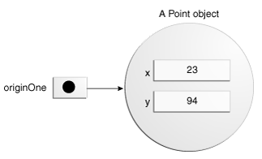

# 5주차 : 클래스

## 클래스란 무엇일까?

클래스를 정의하는 법을 알아보기 전 우선 클래스가 무엇인지 확인하겠습니다. 일반적으로 객체지향 언어에서 ***“클래스는 붕어빵을 만드는 틀이다“*** 라고들 많이 표현하는데요. 이 말은 일반적으로는 맞는 말입니다. 그 이유는 객체 지향 언어는 이름에도 명시되어 있 듯 객체가 모든 것의 중심입니다.

프로그램에 필요한 기능들 역시 객체가 수행하고 객체들의 협력으로 모든 것이 이루어지죠. 그리고 그 객체를 프로그래밍 언어에서 표현하는 프레임이 바로 **클래스**입니다. 즉 붕어빵(객체)를 만드는 틀(클래스)인 것이죠. 다만 여기서 조금의 주의사항이 있다면 클래스와 객체 그리고 인스턴스는 조금씩 다르다는 사실입니다. 

앞서 말했듯 객체는 객체입니다. 어떤 일을 수행해야할 책임을 갖고 자율적으로 행동하는 존재이죠. 물론 어떤 일이라는 것은 프로그램에서 수행해야하는 특정 기능을 의미합니다. 그리고 이런 객체를 **프로그래밍 언어로 정의해놓은 것을 클래스**라고 합니다. 그리고 이 클래스가 런타임에 실제로 생성되어 **메모리에 올라가게 되면 이를** **인스턴스**라고 합니다.

---

## 클래스 정의하는 방법

그렇다면 클래스는 어떻게 정의될까요? 자 쉽게 **이상한 나라의 앨리스에 나오는 ‘앨리스’**를 예시로 들어보겠습니다. 우리가 앨리스를 객체로 만들어본다고 가정해보죠. 우리에게 필요한 건 무엇일까요? 앨리스의 키는 몇인지, 몸무게는 얼마나 나가는지, 좋아하는 음식은 무엇인지, 달리기는 잘하는지 등 다양한 요소들이 있습니다.

### 1. 이름

이 중 첫 번째로 ****앨리스라는 **이름**이 필요합니다. 클래스의 네이밍 규칙은 아래와 같습니다. 아 잠깐, 얘기를 더하자면 우리는 절대 **네이밍을 쉽게 봐선 안됩니다**. 집에서 혼자서 투닥투닥 진행하는 프로그래밍은 이름을 아무렇게나 지어도 괜찮습니다. 하지만 실무에서의 개발은 수많은 팀원들이 모여 하나의 애플리케이션을 구성합니다. 이건 각자의 코드를 기여하는 팀적인 동시에 반드시 규칙이 필요한 작업이죠. 또한 이러한 네이밍 외에도 도메인 지식에 따른 네이밍 컨벤션을 지키며 클래스 혹은 메서드, 변수 등에 모두가 이해할 수 있는 쉽고 직관적인 이름을 짓는 것은 매우 필수적이고 중요한 일입니다. 예를 들어 ‘검색’이라는 기능을 누구는 find, 누구는 search, 누구는 select라는 단어를 사용한다고 가정해볼까요? 새로운 개발자가 들어온다면 세 개 중 도대체 어떤 단어를 써야 할까요? 같은 기능을 수행하거나 같은 책임을 갖는 무엇에 대해 같은 단어를 사용한다는 것은 이렇게나 중요합니다. 자 이제 네이밍이 얼마나 중요한 지 충분히 이해하셨을 거라고 믿겠습니다. 이제 클래스의 네이밍 규칙을 알아보죠.

1. **하나 이상의 문자로 이뤄져야 합니다.**
    
    *→ ex.* Car, SportsCar
    
2. **첫 글자에는 숫자가 올 수 없으며, 대문자여야 합니다.**
3. **‘$’, ‘_’ 외에 어떠한 특수문자도 불가능합니다.**
4. **자바 예약 키워드는 사용할 수 없습니다.**
    
    → *ex.* int, for
    

### 2. 상태

두 번째로 필요한 것은 **상태**입니다. 아까는 우리는 앨리스의 키가 몇인지 몸무게가 얼마나 나가는지가 필요했습니다. 과연 우리에게 상태는 왜 필요할까요? 혹시 앨리스가 처음 이상한 나라에 떨어졌을 때 조그만 문을 통과하기 위해 음료수를 마셨던 것을 기억하시나요? 그 때 앨리스에게 작은 문으로 나가기 위해서 필요한 조건은 무엇이었을까요? 바로 ‘키'입니다. 이 키는 앨리스가 가진 상태죠. 

여기서 상태가 필요한 이유가 궁금하실텐데요. 이 내용은 조영호님의 서적 ‘객체지향의 사실과 오해'에서 언급되는 부분으로 대체하겠습니다.

> *현실 세계에서 비행기를 타거나 혹은 자판기에서 원하는 음료를 선택하거나, 엘리베이터를 움직이려면 과거의 어떤 행동을 통해 이루어져야 한다. 항공권을 발권하거나, 자판기에 충분한 금액을 넣거나, 엘리베이터의 층수를 누르는 과거의 행동들이 필요하다는 것이다.

즉, 모든 일들의 공통점은 어떤 행동의 결과는 과거에 어떤 행동들이 일어났었느냐에 의존한다는 것이다. 객체도 동일하다. 객체가 주변 환경과의 상호작용에 어떻게 반응하는가는 그 시점까지 **객체에 어떤 일이 발생했느냐**에 좌우된다.
하지만 과거의 발생한 행동의 이력을 통해 현재 발생한 행동의 결과를 판단하는 방식은 복잡하고 번거로우며 이해하기 어렵다. 

따라서 인간은 행동의 과정과 결과를 기술하기 위해 **상태**라는 개념을 고안한 것이다. 비행기의 탑승 여부, 현재까지 투입된 금액의 상태, 엘리베이터의 입력된 층수값이라는 상태를 통해 행동의 결과를 쉽게 예측하며 설명할 수 있다. 우리는 위처럼 상태를 이용하여 현재를 기반으로 객체의 행동 방식을 이해할 수 있다.*
> 

### 3. 행동

마지막으로는 **행동**입니다. 앞서 객체는 프로그램의 특정 기능을 수행하는 일에 대해 책임을 갖는다고 말했습니다. 무언가를 수행한다는 것은 해당 일을 처리하기 위해 움직인다는 의미죠. 당연히 행동이 필요합니다. 물론 DTO같은 단순히 데이터 보부상의 역할을 수행하는 객체들에겐 행동이라는 개념이 필요없기도 합니다. 

### 4. 구현 코드

아래는 앨리스라는 클래스의 소스 코드입니다. 이름과 상태, 행동의 개념을 코드로써 구현했습니다. 

```java
public class Alice { // 이름

		// 상태
    private Long height;
    private Long weight;

		// 생성자
		public Alice(Long height, Long weight) {
        this.height = height;
        this.weight = weight;
    }
		
		// 행동
    public void drinkBeverage(){
        System.out.println("음료수를 마십니다. ");
    }
		
		private void setWeight(Long weight) {
        this.weight = weight;
    }

    private void setHeight(Long height) {
        this.height = height;
    }
}
```

- 위에 작성된 **인스턴스 필드(상태), 생성자, 메서드(행동)**는 전부 클래스에서 생성된 인스턴스의 수명 주기를 제공하는 코드입니다.
    - 새 개체를 초기화하기 위한 생성자
    - 클래스 및 해당 개체의 상태를 제공하는 필드 선언
    - 클래스 및 해당 개체의 동작을 구현하는 메서드
- ***public ? private ?***
    - 객체는 상태를 가진다고 말했습니다. 그런데 앨리스의 키와 몸무게의 값이 얼마나 되는지 우리는 어떻게 알 수 있을까요? 우린 대부분 다른 사람에게 키와 몸무게를 잘 묻지 않습니다. 왜냐하면 그 사람의 프라이버시이기 때문이죠. 즉 객체의 상태는 반드시 정보의 접근에 대한 제어가 필요하다는 의미입니다. 객체지향 언어에서는 이와 같은 접근 제어 메커니즘을 **접근 제어자(수정자)**를 통해 구현했으며, 자바에서는 총 4가지가 존재합니다.
        - *public* : 다른 패키지, 다른 클래스 어디서든 접근이 가능합니다.
        - *protected* : 같은 패키지, 클래스 내부, 자신을 상속한 하위 클래스에서만 접근이 가능합니다.
        - *default* : 같은 패키지, 클래스 내부에서만 접근이 가능합니다.
        - *private* : 클래스 내부에서만 접근이 가능합니다.
    - 이마에 키와 몸무게를 써붙이고 다니는 것(접근 제어자가 public이라고 볼 수 있겠죠?)이 아닌 이상 우리는 예의를 갖춰 **질문**을 통해 물어봐야 합니다.
        - 객체지향 세계에서는 이 질문을 **메시지**라고 합니다.
        - 모든 객체들은 메시지를 통해 커뮤니케이션합니다. 아주 중요한 사실이니 절대 잊어서는 안됩니다.
- ***Constructor(생성자)***
    - 클래스에는 클래스를 실제 인스턴스로 생성하기 위한 기본 생성자가 포함됩니다.
        - 만약 생성자를 개발자가 별도로 생성하지 않는 경우 컴파일 시에 컴파일러는 생성자가 없는 모든 클래스에 대해 인수가 없는 기본 생성자를 자동으로 제공합니다. 자동으로 기본 생성자를 생성합니다.
        - 제공되는 기본 생성자는 슈퍼클래스의 인수가 없는 생성자를 호출합니다.
        - 만약 이 경우 클래스의 슈퍼클래스에 인수가 없는 생성자가 있는 경우 문제가 생길 수 있습니다. 따라서 이런 케이스는 반드시 확인이 필요합니다.
        - 클래스에 명시적 수퍼클래스가 없는 경우, 인수가 없는 생성자가 있는 **Object 클래스의 생성자**를 사용하게 됩니다.
    - 생성자는 클래스 이름을 사용하고 반환 타입이 클래스 인스턴스인 점을 제외하면 메서드를 선언하는 방식과 유사합니다
        - 다만 인수의 개수와 인수의 타입에 따라 다양한 생성자의 생성이 가능합니다. 하지만 동일한 인자 갯수와 타입을 가진 경우는 컴파일 타임 예외가 발생합니다.
    - 내부의 인스턴스 필드를 초기화하는 것도 가능합니다.
        - this 키워드를 통해 클래스 필드에 직접 접근할 수 있는데 이는 뒤에서 설명하겠습니다.
        - 이번 예제에서는 setter 메서드를 통해 객체가 **스스로와도 메시지를 통해 협력**할 수 있도록 구현했습니다.
- ***extends, implements***
    - 객체는 다른 추상 클래스 객체를 상속하거나 인터페이스를 구현할 수 있습니다.
- 클래스에는 접근 제어자 외에도 여러가지 키워드들을 붙힐 수 있습니다.
    - 위애서 말한 추상 클래스를 만들기 위해선 ***abstract***
    - 자바에서 수행하는 객체 직렬화 범위에서 제외시키기 위한 ***transient***
        - 직렬화가 무엇인지 아주 가볍게 소개하겠습니다. 자바는 원래 네트워크 환경을 타겟으로 개발된 언어입니다. 따라서 Java의 객체들을 네트워크 환경에서 온전히 전달하기 위해선 바이트 코드로 변환하는 작업이 필요합니다. 이 때 사용하는 방법이 직렬화입니다.
    - 캐시를 거치지 않고 변수를 메인 메모리에 바로 저장하기 위해서 사용되는 ***[volatile](https://nesoy.github.io/articles/2018-06/Java-volatile)***
        - 우리가 흔히 사용하는 스프링 프레임워크는 멀티 쓰레드 기반으로 동작합니다. 이 경우 스레드들은 JVM 내부의 스택 메모리 외에 다른 저장 공간들을 공유합니다. 그리고 스레드들은 성능 향상을 목적으로 필요한 변수 값들을 매번 메모리에 접근해서 가져오는 것이 아니라 CPU 캐시에 저장하죠.
        - 하지만 위에서 언급했듯 스레드는 저장소를 여럿이 공유하고 접근하기 때문에 **값의 정합성 문제**가 존재합니다. 예를 들어보자면 만약 멀티 CPU 환경에서 이들이 메인 메모리의 특정 변수를 공유한 상태에서 값을 읽거나 수정하는 경우, 이 값들은 메인 메모리가 아닌 CPU 캐시에만 반영됩니다. 즉 각각 스레드가 수정 작업을 하고 있음에도 실제는 서로의 값을 공유하지 못하는 **값의 불일치 문제**가 발생하게 되는 것이죠.
        - 이 경우 **읽기&쓰기의 원자성을 보장**하기 위해 사용됩니다.

---

### 객체 만드는 방법 (new 키워드 이해하기)

객체를 생성하는 방법은 다양합니다. 아까 우린 클래스가 객체를 프로그래밍 언어로 구현하기 위한 프레임이라고 말했습니다. oracle docs에서는 클래스를 ‘**객체에 대한 청사진’** 이라고 표현하네요. ****

```java
Point originOne = new Point(23, 94);
Rectangle rectOne = new Rectangle(originOne);
Rectangle rectTwo = new Rectangle(50, 100);
```

위 코드는 클래스의 new 연산자를 통해 인스턴스를 생성하고 변수를 생성한 뒤 해당 변수에 인스턴스를 할당하는 예시입니다. 여기서 우리는 세 가지에 집중해야 합니다.

1. **선언**
    
    → 위 예시에서 = 를 기준으로 좌측에 있는 코드들은 모두 **변수를 선언**하는 코드입니다. 그리고 생성된 변수들의 타입은 각각 변수명의 좌측에 있는 클래스로 매핑되죠.
    
2. **인스턴스화
→** new 키워드는 객체를 인스턴스로 생성하는 Java 연산자입니다.
3. **초기화**
    
    → new 연산자 다음에는 새로운 객체를 좌변에서 생성한 인스턴스로 초기화하는 생성자에 대한 호출이 옵니다.
    

> **선언 (Declaration)**
> 
- 우리가 변수를 선언할 때는 보통 아래와 같이 변수의 타입과 이름의 나열로 선언합니다.
    
    ```java
    Point originOne; // type + name
    ```
    
    - 이것은 사실 **‘변수를 선언한다'**라는 의미입니다. 그런데 컴퓨터는 이것을 어떻게 받아들일까요?
        - 사실 위 코드의 실제 의미는 타입이 `Point`인 데이터를 참조하기 위해 *originOne*이라는 변수명을 사용할 것임을 컴파일러에 알리는 것입니다. 또한 이 코드를 통해 변수에 대한 적절한 양의 메모리도 예약합니다.
        - 물론 이렇게 originOne을 선언한다고 해도 객체가 실제로 생성되어 할당될 때까지 값은 미정인 상태로 남아있습니다. 단순히 참조 변수를 선언한다고 해서 객체가 생성되진 않습니다.
        - 그리고 우리가 이 변수에 실제 객체를 넣기 위해선 **new 연산자를 사용**해야 합니다. 반드시 코드에서 개체를 사용하기 전에 originOne에 개체를 할당해야 하며, 그렇지 않은 경우 **컴파일러 오류가 발생**합니다.
        - 위 참조 변수는 인스턴스가 할당되지 않았습니다. Heap 메모리에 올라간 실제 객체의 주소 중 어느 것도 가리키지 않는 상태라는 거죠. 따라서 이 변수를 사용하려고 컴파일 시점에 코드를 작성하면 위에서 언급한 것처럼 컴파일러 오류가 발생합니다.
            
            <p align="center"></p>
            

> **인스턴스화 **(Instantiation)**
> 
- new 연산자는 새로운 객체에 대한 메모리를 할당하고 해당 메모리에 대한 참조를 반환하여 클래스를 인스턴스화합니다. 이 단계에서 new 연산자는 객체 생성자를 호출합니다.
    - new 연산자에는 단일 후위 인수인 생성자 호출이 필요합니다. 생성자의 이름은 인스턴스화할 클래스의 이름을 제공합니다.
        - *ex.* `new` + `Point(23, 94)`
    - new 연산자는 생성한 객체에 대한 참조를 반환합니다. 만약 변수에 할당할 필요가 없는 경우라면 표현식에서 직접 사용도 가능합니다.
        
        ```java
        // 객체에 대한 참조를 반환하는 케이스
        Alice alice = new Alice(170L,  60L);
        System.out.println("alice = " + alice); // alice = week5.Alice@3796751b
        
        // 표현식에서 직접 사용하는 케이스
        new Alice(165L, 55L).drinkBeverage(); // 음료수를 마십니다.
        ```
        

> **초기화 **(Initializing)**
> 

```java
public class Point {
    public int x = 0;
    public int y = 0;

    //constructor
    public Point(int a, int b) {
        x = a;
        y = b;
    }
}
```

- 위 코드에서 Point 클래스의 생성자를 구별하는 방법은 아주 간단합니다.
    - 클래스와 동일한 이름을 사용하고 반환 유형이 없는 메서드를 찾으면 됩니다. ~~주석으로 표시해놓은 건 잠시 눈감아 주시면 감사하겠습니다.~~
    - 그렇다면 위 생성자가 실행될 때 실제 메모리에는 어떤 일이 일어날까요?
        
        <p align="center"></p>
        
        - 메모리 관점에서 얘기하자면 우선 originOne 참조 변수는 **Stack 영역**에 생성되고, **Heap** 영역에 실제로 생성된 Point Object의 **주소값을 참조**하게 됩니다.
        - 여기서 언급한 스택 영역은 JVM 내부에서 생성된 스레드의 고유 영역입니다. 하지만 Heap 영역은 JVM 당 하나만 생성되기 때문에 스레드 간 공유됩니다. 더 깊은 설명은 생략하겠습니다.
    - 만약 다른 객체가 생성자에서 originOne을 인자로 가져가는 경우라면 해당 인자에는 originOne의 주소값이 전달됩니다.
- 컴파일러는 인수의 수와 유형에 따라 생성자를 구별합니다.
- 모든 클래스에는 하나 이상의 생성자가 있습니다. 그 이유는 클래스가 명시적으로 생성자를 선언하지 않은 경우 컴파일러가 기본 생성자(인수가 없는 생성자)를 자동으로 제공하기 때문입니다.
    - 기본 생성자는 부모 클래스의 기본 생성자를 호출하거나 클래스가 부모 생성자가 없는 경우 Object 생성자를 호출합니다.
        - 만약 부모 클래스에 생성자가 없으면(Object에는 생성자가 있음) 컴파일러는 프로그램을 거부합니다.

---

### 메소드 정의하는 방법

메서드를 선언하기 위해선 필수적으로는 총 4가지가 필요하며, 일반적으로 이 외에는 총 6가지의 구성 요소가 존재합니다. 

> **필수 요소**
> 
- 메서드의 반환 유형
- 이름
- 인자를 담을 ()
- 메서드 바디를 담을 {}

> **구성 요소**
> 
- 접근 제어자
- 반환 타입 → 메소드에 의해 반환되는 값의 데이터 유형을 말합니다. 만약 메소드가 값을 반환하지 않는 경우 void를 선언합니다.
- 메서드 이름 → 필드를 정의할 때 사용하는 네이밍 규칙과 유사하지만 약간 다릅니다.
- 매개변수 목록 → 매개변수가 여러 개인 경우 쉼표로 구분하며, 데이터 타입이 좌측에 변수명이 우측에 옵니다. 매개변수가 없는 경우 비워두면 됩니다.
- 예외 목록
- 메서드 본문(중괄호로 묶인)

> **메서드 네이밍**
> 
- 메서드는 컨벤션에 따라 메서드 이름은 소문자 동사 또는 소문자 동사로 시작하면서 형용사, 명사 등이 합쳐진 여러 단어로 구성된 이름이어야 합니다.
- 만약 여러 단어로 된 이름의 경우 첫 번째에서 이어지는 두 번째 단어와 그 다음 이어지는 단어들의 첫 글자는 대문자로 작성되 다른 단어임이 구분되어야 합니다.
    - *ex.* run, run**F**ast, get**B**ackground, get**F**inal**D**ata, compare**T**o, set**X**, is**E**mpty

> **메서드 오버로딩**
> 
- Java 에서는 **메서드 오버로딩** 을 지원합니다. 메서드 오버로딩이란 **같은 메서드 이름을 갖더라도 시그니쳐가 다르다면 이를 다른 메서드로 구별**하는 것을 말합니다.
    
    ```java
    // Available case
    public void load(String param) {}
    public void load(String param, String param2) {}
    public void load(int param, String param2) {}
    ```
    
    - 만약 시그니처부터 이름까지 모든 것이 동일하다면 컴파일러는 이를 구분하지 못합니다.
        
        ```java
        // Fail Case #1
        // compiler cannot distinguish, 'sameMethod(String)' is already defined in 'week5.MethodOverloading'
        public void sameMethod(String param) {}
        public void sameMethod(String param) {}
        ```
        
    - 또한 컴파일러는 메서드를 구분할 때 반환 형식을 고려하지 않습니다. 따라서 반환 형식이 다르더라도 동일한 시그니처를 가진다면 메서드는 선언이 불가능합니다.
        
        ```java
        // Fail Case #2
        // 'diffReturnType(String)' clashes with 'diffReturnType(String)'; both methods have same erasure
        public void diffReturnType(String param) {}
        public String diffReturnType(String param) {}
        ```
        
- 만약 클래스 내의 메소드가 다른 매개변수 목록을 갖고 있는 경우 동일한 이름을 가질 수 있음을 의미합니다.
- 따라서 오버로드된 메서드는 메서드에 전달된 인수의 수와 유형을 통해 구분됩니다.

---

### this 키워드 이해하기

- 우선 **this** 란 클래스의 메서드 혹은 생성자 내에서 **현재 객체에 대한 참조**를 의미합니다. 메서드 또는 생성자가 호출되는 객체로써, 인스턴스 메서드 또는 생성자 내에서 현재 개체의 모든 멤버를 참조할 수 있습니다.
- 일반적으로 this 키워드를 사용하는 가장 일반적인 이유는 필드가 메서드 또는 생성자 매개변수에 의해 가려지기 때문입니다.
    
    ```java
    // AS-IS
    public Point(int a, int b) {
        x = a;
        y = b;
    }
    
    // TO-BE
    public Point(int x, int y) {
        this.x = x;
        this.y = y;
    }
    ```
    
- 생성자 내에서 this 키워드를 사용하여 동일한 클래스의 다른 생성자의 호출이 가능합니다. 이를 우리는 **명시적 생성자 호출**이라고 합니다.

> ***this 와 동적 메서드 탐색***
> 
- 객체지향에서 객체는 모든 커뮤니케이션을 메시지를 통해 수행한다고 언급했었다. 메시지를 수신한 객체는 스스로가 메시지의 책임을 수행할 수 있는지 탐색한다.
    - 이 탐색의 과정에서 객체는 자신에게서 메서드를 찾지 못하는 경우 부모 클래스에서 메서드 탐색을 계속하게 된다.
        - 이 과정은 적합한 메서드를 찾을 때까지 계속해서 상위 계층으로 거슬러 올라간다.
    - 이 때 **메시지를 수신한 객체를 기억하기 위해 사용하는 것이 바로 self 참조 변수**인데, 자바에서는 이를 **this**를 통해 구현했다.
        - 객체가 메시지를 수신하면 컴파일러는 self 참조 변수를 임시로 생성해 메시지를 수신한 객체를 가리키도록 설정한다.
        - 메시지 탐색은 self 참조 변수에서 시작되며 탐색이 완료될 때 같이 소멸된다.
- 정리하자면 this(self 변수)는 런타임에서 실제로 메시지를 수신한 객체를 기억함으로써 **메서드 탐색 경로를 결정하는 기준의 역할**을 수행한다.

---

### 참고자료

- [https://docs.oracle.com/javase/tutorial/java/javaOO/classdecl.html](https://docs.oracle.com/javase/tutorial/java/javaOO/classdecl.html)
- [https://docs.oracle.com/javase/tutorial/java/javaOO/variables.html](https://docs.oracle.com/javase/tutorial/java/javaOO/variables.html)
- [https://docs.oracle.com/javase/tutorial/java/javaOO/methods.html](https://docs.oracle.com/javase/tutorial/java/javaOO/methods.html)
- [https://docs.oracle.com/javase/tutorial/java/javaOO/thiskey.html](https://docs.oracle.com/javase/tutorial/java/javaOO/thiskey.html)